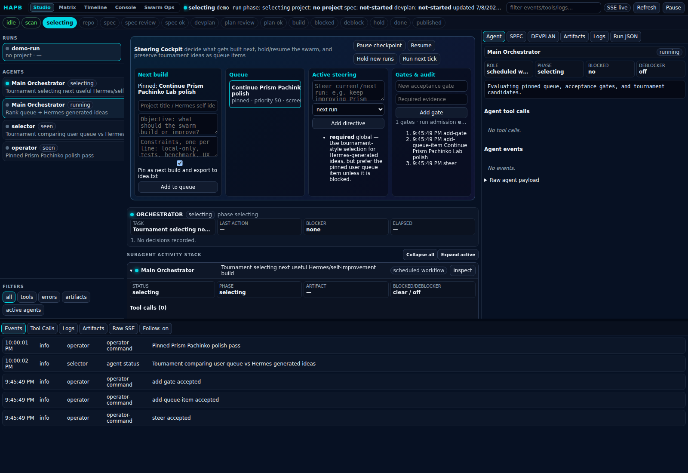

# Hermes Swarm Builder

Hermes Swarm Builder packages a local autonomous-project workflow for a Hermes host: an hourly non-overlapping runner, governed runner prompt, telemetry helper, live steering/observability dashboard, systemd/cron install scaffolding, and operational docs.

The system lets a Hermes agent run a complete local build cycle later on a schedule:

1. scan prior local builds and project inventory,
2. select a coherent project candidate,
3. create a local repo,
4. generate and review a substantial SPEC,
5. generate and review a substantial DEVPLAN,
6. orchestrate implementation with visible subagents,
7. validate tests/docs/artifacts,
8. publish only completed validated work to an external showcase if configured.

It intentionally does **not** expose arbitrary browser shells, secrets, ROMs, credentials, or runtime artifacts.

## Vocabulary-first model

Hermes Swarm Builder uses the same bounded terms in the runner, dashboard, artifacts, and handoff docs:

- **Run**: one scheduled or manual runner invocation. A run owns logs, telemetry, artifacts, and final gate reports under `runs/<run-id>/`.
- **Iteration**: a bounded improvement pass against an existing repo or prior run output. An iteration can start fresh, continue, resume, or fork.
- **Generation**: one cycle inside an iteration where variants are produced, evaluated, synthesized, and gated.
- **Variant**: one focused alternative generated for the same objective and constraints.
- **Evaluator**: an agent or deterministic process that scores variants against fixed criteria and records evidence.
- **Synthesis / mashup**: the deliberate integration of the strongest compatible variant features into the next accepted direction.
- **Gate**: an acceptance requirement that needs explicit evidence before progress or completion.
- **Evidence**: screenshots, diffs, logs, tests, accessibility/performance checks, or operator notes used to support a decision.
- **Decision**: an auditable accept/reject/continue/fork/gate outcome with rationale and evidence links.
- **Resume point**: the durable artifact set needed to continue later without rediscovering context.
- **Fork**: a new iteration branched from prior evidence to explore a different direction while preserving lineage.

## Run and iteration artifact meanings

```text
~/.hermes/autonomous-projects/runs/<run-id>/
  run.json                       run-level state mirror
  iteration-state.json            runner-created iteration contract, when iteration mode is active
  lifecycle-contract.json         immutable managed launch inputs plus lifecycle status
  logs/                           runner and Hermes stdout/stderr logs
  worktrees/                      runner-managed variant/mashup git worktrees, when worktree-loop mode is active
  artifacts/
    iterations/iteration.json     copy of the iteration contract for artifact browsers
    source-evidence.json          source run/iteration context used for resume/fork
    variants/*.json               variant claims, changes, and evidence
    variants/*.diff               runner-captured diffs from base commit to variant branch
    evaluations/*.json            evaluator scores and rationale
    synthesis/synthesis.json      selected compatible features and mashup rationale
    gate-decisions.json           gate pass/fail/needs-evidence decisions
    gate-report.json              final validation evidence
    lifecycle-contract.json       artifact-browser copy of the managed lifecycle contract
    handoff.json                  terminal operator handoff for every managed outcome
    artifact-manifest.json        index of important generated artifacts
```

Future agents should treat `lifecycle-contract.json`, `iteration-state.json`, `source-evidence.json`, `variants/*.json`, `evaluations/*.json`, `synthesis/synthesis.json`, `gate-decisions.json`, `handoff.json`, and `artifact-manifest.json` as the minimum resume set.

See `docs/OPERATIONS.md#cleanup-and-browser-validation-gates` for cleanup and Playwright/browser gate evidence before accepting generated UI projects.

## Continuous showcase catalogue mode

The dashboard now has an explicit **Run 10-generation showcase loop** control for the Hermes Unique Showcase Website. It persists `control.autoIteration` with `mode: "showcase-loop"`, `targetGenerations <= 10`, the target repo path, generation counters, and bounded safety caps. Each completed generation records variants, evaluations, synthesis, gate decisions, and the accepted mashup commit; the runner then queues the next generation from that commit until the target is reached or the operator presses **Pause loop**, **Stop loop**, or **Hold new runs**.

This mode is intentionally catalogue-shaped: the Mission Control catalogue shows the latest 10 same-site generations so an operator can browse different versions, continue one, fork one, or use an accepted direction as the next baseline.


## Quick install prompt for a Hermes agent

Copy this prompt into a Hermes agent on the target machine:

```text
Install Hermes Swarm Builder from GitHub and link me to the dashboard.

Repository: https://github.com/mojomast/hermesswarmbuilder

Requirements and constraints:
- Use my normal user account, not root.
- Install source under ~/repos/hermesswarmbuilder unless I specify otherwise.
- Use Bun for the dashboard and runner. If bun is not installed, stop and tell me exactly what is missing.
- Install the dashboard to ~/.hermes/autonomous-projects-dashboard.
- Install state/runtime directories under ~/.hermes/autonomous-projects.
- Install the runner at ~/.hermes/scripts/autonomous-project-midnight-runner.ts.
- Install telemetry.py at ~/.hermes/autonomous-projects/telemetry.py.
- Install runner-prompt.md at ~/.hermes/autonomous-projects/runner-prompt.md.
- Create/enable/start the user systemd service autonomous-projects-dashboard.service on port 9200.
- Add the hourly cron entry for the runner, replacing any old autonomous-project-midnight-runner entry. The runner skips launch when a project is still active and waits for the next hourly tick.
- Do not start a full autonomous project run unless I explicitly ask after installation.
- Do not push anything to GitHub.
- Verify with curl -I http://127.0.0.1:9200/ and systemctl --user status autonomous-projects-dashboard.service --no-pager.
- If my hostname is available, give me the dashboard URL as http://HOSTNAME:9200/; otherwise give http://127.0.0.1:9200/.

Commands you may use:
  mkdir -p ~/repos
  cd ~/repos
  git clone https://github.com/mojomast/hermesswarmbuilder.git
  cd hermesswarmbuilder
  ./scripts/install.sh
  ./scripts/add-webhub-card.sh   # only if ~/.hermes/web-hub/index.html exists
```

Expected dashboard link on the Hermes host:

```text
http://<hermes-hostname-or-ip>:9200/
```

Local fallback:

```text
http://127.0.0.1:9200/
```

## What is included

```text
dashboard/       Bun live steering + operations dashboard (5 dynamic views)
runner/          Hourly non-overlapping runner that invokes `hermes chat` with telemetry env vars
telemetry/       Canonical Python telemetry writer for state/events/run mirrors
prompts/         Governed autonomous-builder runner prompt
systemd/         User service template
scripts/         Installer, one-shot runner wrapper, web-hub card helper
docs/            Architecture, operations notes, and screenshots
```

## 🐝 The Builder Swarm: From Idea to Working Product

Hermes Swarm Builder coordinates an autonomous multi-agent swarm to engineer complete software products from start to finish. The system provides flexible idea ingestion alongside a structured subagent pipeline.

### 💡 1. Flexible Idea Selection & Ingestion

Users can either provide their own target project ideas or let the swarm pick autonomously:

* **Custom User-Provided Ideas (Direct Input)**:
  Place your software ideas in `~/.hermes/autonomous-projects/ideas.md` (or `ideas.json` / `idea.txt`). During the selection phase, the `selector` subagent prioritizes your explicit ideas list and picks your target prompt to build.
* **Autonomous Inventory Selection (Autonomous Mode)**:
  If no custom idea file is found, the `selector` subagent scans local skills, repositories, and frameworks (e.g., local game engines or tools under `~/.hermes/skills`), picking an optimal project candidate based on current steering directives.

### ⚙️ 2. The Multi-Agent Swarm Lifecycle

Once an idea is selected, specialized subagents collaborate through strict quality-gated phases:

1. **Selection & Discovery (`selector`)**: Analyzes candidate ideas or local inventory to establish the architecture foundation.
2. **Exhaustive Specification (`spec-author`, `research-reviewer`, `safety-reviewer`, `spec-auditor`)**:
   `spec-author` drafts a comprehensive 3,000+ word technical specification (`SPEC.md`). Reviewer subagents perform safety checks, novelty analysis, and architecture validation before approval.
3. **Competing DevPlans & Reconciliation (`devplan-writer-a`, `devplan-writer-b`, `devplan-reconciler`)**:
   Two writer subagents propose competing step-by-step development plans. The reconciler subagent synthesizes the best approaches into a unified `DEVPLAN.md`.
4. **Parallel Implementation Swarm (`build-orchestrator`, `worker-core`, `worker-cli`, `worker-risk`, `testing-subagent`, `docs-subagent`)**:
   The build orchestrator delegates modules across specialized worker subagents who write code, construct test suites, implement CLI/web interfaces, and author documentation in parallel.
5. **Autonomous Deblocking & Self-Correction (`deblocker`)**:
   If test failures or execution blockers arise during implementation, the `deblocker` subagent diagnoses errors, applies code patches, and validates fixes in real time.
6. **Final Audit & Verification (`final-auditor`)**:
   Validates test suite execution, security constraints, and artifact completion before finalizing the build product.


## Installed runtime layout

The installer copies source into this layout:

```text
~/.hermes/autonomous-projects-dashboard/
  src/server.ts
  public/index.html    (Classic Studio)
  public/matrix.html   (Command Matrix)
  public/timeline.html (Timeline Stream)
  public/console.html  (Developer Console)
  public/*.js
  public/*.css

~/.hermes/autonomous-projects/
  state.json
  events.jsonl
  telemetry.py
  runner-prompt.md
  runs/
  logs/
  artifacts/

~/.hermes/scripts/
  autonomous-project-midnight-runner.ts
```

The dashboard is a local control plane. It reads `state.json`, efficiently tails `events.jsonl`, previews run artifacts/logs, and writes narrow steering commands (`control.json`, `queue.json`, `gates.json`, `commands.jsonl`, `audit.jsonl`). It does not provide arbitrary shell execution.

## Install manually

```bash
git clone https://github.com/mojomast/hermesswarmbuilder.git ~/repos/hermesswarmbuilder
cd ~/repos/hermesswarmbuilder
./scripts/install.sh
```

Optional environment overrides:

```bash
PORT=9300 ./scripts/install.sh
HERMES_HOME=/path/to/hermes-home ./scripts/install.sh
INSTALL_CRON=0 ./scripts/install.sh
INSTALL_SERVICE=0 ./scripts/install.sh
BUN_BIN=/home/me/.bun/bin/bun ./scripts/install.sh
PUBLIC_HOST=<hermes-hostname-or-ip> ./scripts/install.sh
```

Add a card to an existing static local web hub if present:

```bash
./scripts/add-webhub-card.sh
```

## Verify

```bash
systemctl --user status autonomous-projects-dashboard.service --no-pager
curl -I http://127.0.0.1:9200/
crontab -l | grep autonomous-project-midnight-runner
```

Open:

```text
http://127.0.0.1:9200/
```

or on any reachable LAN/VPN/DNS host:

```text
http://<host>:9200/
```

## Running one build manually

The cron runs once an hour and the runner exits without launching if a project is already active. To trigger a run manually after install:

```bash
~/.npm-global/bin/bun ~/.hermes/scripts/autonomous-project-midnight-runner.ts \
  >> ~/.hermes/autonomous-projects/logs/manual-runner-$(date +%Y%m%d-%H%M%S).log 2>&1
```

or from this repository after install:

```bash
./scripts/run-once.sh
```

The dashboard should show a new run under `/api/state` and the run list.

## Dashboard behavior



The dashboard shows:

- steering cockpit for pause/resume/hold/run-next-tick commands,
- next-build queue with pinned user ideas and Hermes-generated tournament ideas,
- active steering directives and acceptance gates,
- top-level workflow phase strip,
- current-step and live-activity summary for the active generation, phase, task, run, repo, and freshest agent telemetry,
- compact/comfortable/dense layout density controls for fitting more run state on screen,
- browser-local hide/collapse controls for major dashboard sections,
- run list,
- agent/subagent list,
- subagent activity stack,
- tool-call lifecycle rows,
- event console,
- SPEC and DEVPLAN preview tabs,
- artifact and log previews,
- raw run JSON.

Live updates use SSE from `/api/stream`. The server tails the event file instead of reparsing the full history on every tick, sends incremental event batches by cursor, redacts secret-shaped strings, and the frontend coalesces live renders so long-running tabs stay responsive. Artifact/log previews are cached client-side per run/file so live refreshes do not flash the preview back to `Loading...` while you are reading.

Dashboard layout preferences are browser-local. Density, hidden/collapsed sections, expanded agents/tools, selected tabs, and follow/pause choices are stored in `localStorage` under `hermes.apb.dashboard.*`; they do not modify runner control files and can be reset by clearing dashboard site data or pressing **Reset layout** in the Sections menu.

## Steering cockpit

The Studio view (`/`) includes a local-only project-management cockpit. It writes auditable JSON/JSONL control files under `~/.hermes/autonomous-projects`:

```text
control.json     desired mode, pause/stop/hold, active steering, pinned queue item
queue.json       ranked project ideas from the user or Hermes idea tournaments
gates.json       reusable acceptance gates with required evidence
commands.jsonl   append-only operator commands
audit.jsonl      append-only command/results audit trail
```

Use it to:

- add/pin the next thing to build,
- keep iterating an existing repo instead of creating a fresh project,
- add acceptance gates before the next run,
- pause at the next safe checkpoint,
- hold new hourly runs,
- resume when ready,
- request a run on the next runner tick.

Pinned queue items are exported to `idea.txt` for compatibility and are appended to the runner prompt as a hard selector override. If nothing is pinned, the runner prompt still uses tournament-style selection over Hermes-generated ideas and local inventory.

### Showcase loop quick start

The flagship productized workflow is the **Hermes Unique Showcase Website** loop: a same-repo catalogue of bounded generations that makes Hermes' dashboard, Becomussy/governed memory, self-improvement loops, subagent swarms, evidence gates, screenshots, and iteration history visible as a polished website instead of another generic agent wrapper.

From the dashboard, use **Run 10-generation showcase loop**. From the API:

```bash
curl -X POST http://127.0.0.1:9200/api/commands \
  -H 'content-type: application/json' \
  -d '{"type":"start-showcase-loop","payload":{"repoPath":"/home/mojo/autonomous-projects/hermes-showcase-site","targetGenerations":10}}'
```

Each generation is capped by the runner: 1-5 variants, 1-5 parallel variant agents, 1-4 accepted features, at most one visual motif change, at most one new section, and no unrelated feature or tech-stack churn. The runner requires a clean target git repo unless the request explicitly allows dirty state. Completed generations are exposed through `/api/iterations` and can be continued, forked, or promoted as the next direction.

## Telemetry protocol

`telemetry.py` is the canonical writer. It updates:

- `events.jsonl`
- `state.json`
- `$RUN_ROOT/run.json`

Important commands:

```bash
python3 "$APB_TELEMETRY" set-phase ...
python3 "$APB_TELEMETRY" upsert-agent ...
python3 "$APB_TELEMETRY" tool-start ...
python3 "$APB_TELEMETRY" tool-output ...
python3 "$APB_TELEMETRY" tool-end ...
python3 "$APB_TELEMETRY" tool-error ...
python3 "$APB_TELEMETRY" event ...
python3 "$APB_TELEMETRY" complete ...
```

The helper normalizes state shape, keeps agents keyed by stable id, writes schema versions, caps payloads, and redacts common secrets/tokens/private keys.

## Runner behavior

`runner/autonomous-project-midnight-runner.ts`:

- creates a lock directory so overlapping processes do not start,
- checks state and dashboard control files first and skips launch while an existing project is active or new runs are held,
- exports pinned queue items to the run as `idea.txt` and appends the steering snapshot to the prompt,
- initializes run directories and state when idle,
- invokes `hermes chat --verbose --accept-hooks --source autonomous-project-builder --max-turns 90 --toolsets terminal,file,web,delegation` for classic fresh-build runs,
- when `control.nextRunRequest` or `control.autoIteration.enabled` exists, validates the target git repo, resolves a clean base commit, creates bounded variant worktrees under `runs/<run-id>/worktrees/`, launches capped variant agents, captures variant diffs/metadata, runs evaluator agents, synthesizes an accepted mashup, and writes the iteration/gate artifacts,
- passes telemetry env vars into every Hermes process,
- streams stdout/stderr into run logs,
- recognizes explicit `APB_TELEMETRY {json}` lines,
- writes `gate-report.json`, `artifact-manifest.json`, synthesis, and gate decisions on successful managed completion,
- records process start/end/error events,
- avoids clobbering `state.agents` arrays over object state and marks running agents completed after success.

## Current project-quality gates

The packaged runner prompt has strong gates to avoid weak AI slop:

- select substantial projects, not generic wrappers or tiny utilities,
- require multi-component systems,
- require substantial SPEC and DEVPLAN documents,
- require reviewed spec/devplan phases,
- require tests, measurable validation, and final audit,
- require generated runtime artifacts to stay out of commits,
- require safe local-only defaults.

The current product direction is the Hermes Unique Showcase Website: build a memorable local showcase that demonstrates why this Hermes instance is different from generic AI-agent slop. It should surface the dashboard, Swarm Builder, Becomussy as a governed memory/self-model substrate, self-improvement loops, subagent swarms, evidence gates, Playwright/screenshot gates, visible generation history, resume/fork controls, and measured product-quality iteration.

You can steer the next run from the dashboard queue/control APIs or by editing `~/.hermes/autonomous-projects/runner-prompt.md` after install.

## How this was made

This repository was extracted from an active Hermes build session. The workflow evolved in stages:

1. A dashboard scaffold was created under `~/.hermes/autonomous-projects-dashboard` to visualize autonomous runs without exposing an arbitrary browser shell.
2. An hourly non-overlapping runner was created under `~/.hermes/scripts/autonomous-project-midnight-runner.ts` to start real autonomous-project work later via cron rather than immediately.
3. State files were standardized under `~/.hermes/autonomous-projects`: `state.json`, `events.jsonl`, `runs/`, `logs/`, and `artifacts/`.
4. A Python telemetry helper was added to stop the workflow from relying on ad-hoc model-written JSON. It introduced canonical commands for phases, agents, tool calls, events, completion, redaction, and run mirroring.
5. The dashboard frontend was patched to derive subagents from both `state.agents` and telemetry events, preserve scroll/focus during live updates, and cache artifact/log previews to prevent flashing.
6. The runner prompt was strengthened after early runs produced specs/devplans that were too small. It now requires ambitious project selection, substantial docs, reviewed gates, tests, and measurable validation.
7. The dashboard grew from observability into Mission Control: queue pinning, steering directives, gate decisions, iteration detail, resume/fork/use-as-direction commands, and cursor-safe event streaming.
8. The runner added a managed worktree loop for bounded creative iteration: parallel variants, evaluator artifacts, synthesis/mashup, gate decisions, and continuous showcase-catalogue generation.
9. This repository was packaged from the source-only pieces, excluding runtime state, logs, generated artifacts, credentials, and local project outputs.

## Safety and privacy

- Do not commit `~/.hermes/autonomous-projects/runs`, logs, artifacts, databases, `.env`, credentials, ROMs, or private generated files.
- The dashboard writes only narrow local steering/control files and intentionally does not expose arbitrary terminal execution.
- The runner should publish externally only after a completed/validated project if you explicitly wire that behavior.
- Review generated projects before trusting or deploying them.

## License

MIT
